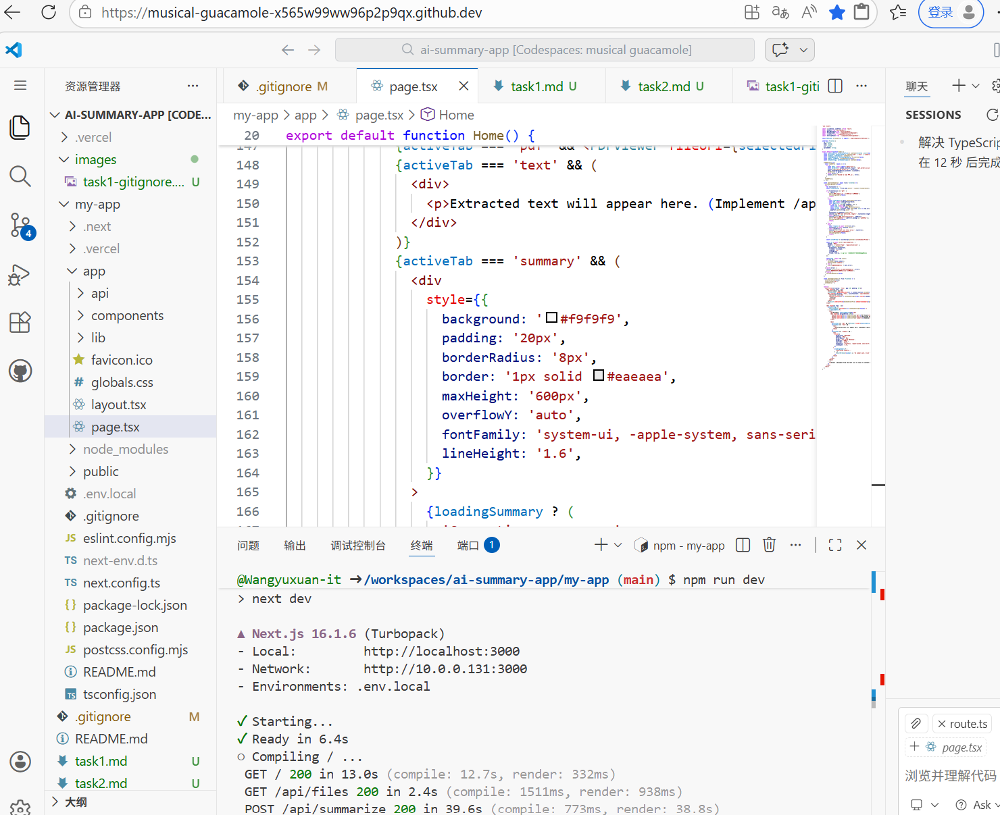
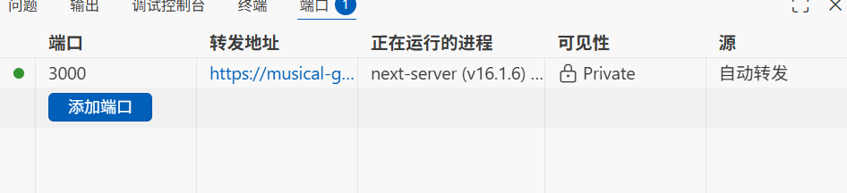
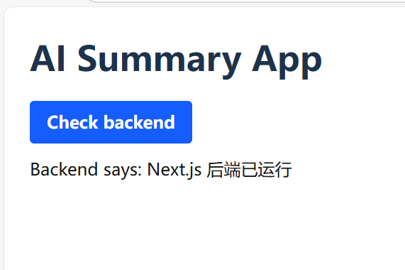
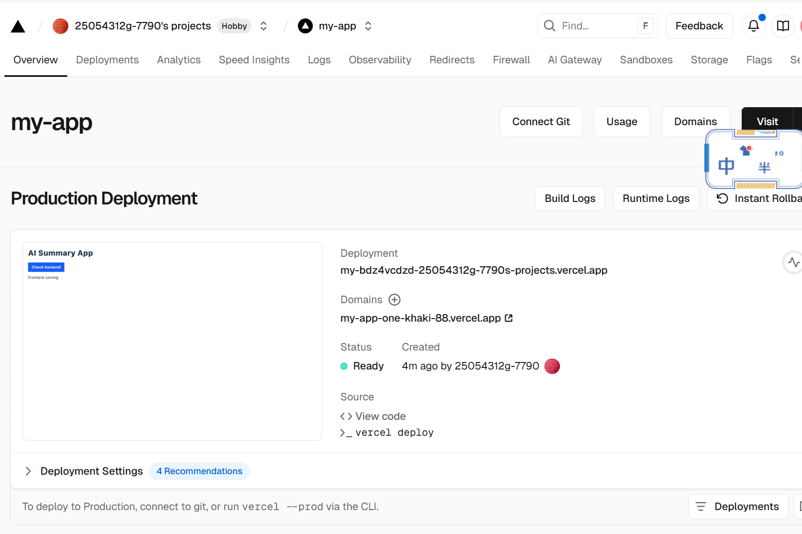

# Task 1: Setting up the Next.js app and basic features

## Section 1: Overview
I set up a new GitHub repository named `ai-summary-app` and launched a Codespace. The project uses Next.js with App Router, TypeScript, and Tailwind CSS. The folder structure follows the standard Next.js layout with additional folders for components, API routes, and utilities.

---

## Section 2: Create a simple Next.js app

1. **Create repository and Codespace**  
   - Created a GitHub repository `ai-summary-app`.  
   - Launched a Codespace from it.  
   

2. **Add `.gitignore`**  
   - Created `.gitignore` file with recommended content to exclude `node_modules`, `.env`, `.next`, etc.  
   - Committed and pushed.  
   

3. **Scaffold Next.js app**  
   - Ran `npx create-next-app@latest my-app --typescript --tailwind` inside the Codespace.  
   - Accepted default settings.  

4. **Run the development server**  
   - `cd my-app`  
   - `npm run dev -- --port 3000`  
   - Opened the forwarded port and saw the default starter page.  


5. **Add a minimal UI**  
   - Replaced `app/page.tsx` with a simple component displaying "AI Summary App" and "Frontend running".  
   - Verified the change in browser.  
   

6. **Commit the scaffold**  
   ```bash
   git add .
   git commit -m "feat(frontend): scaffold Next.js app with basic landing UI"
   git push

