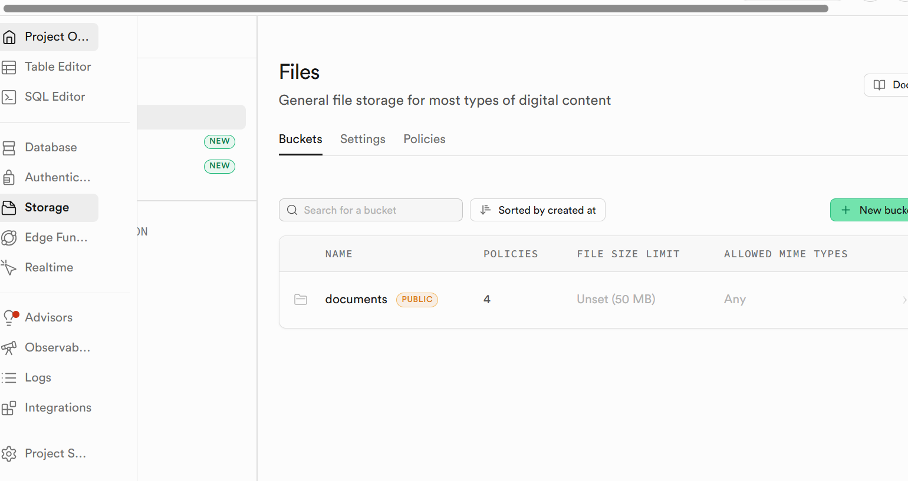
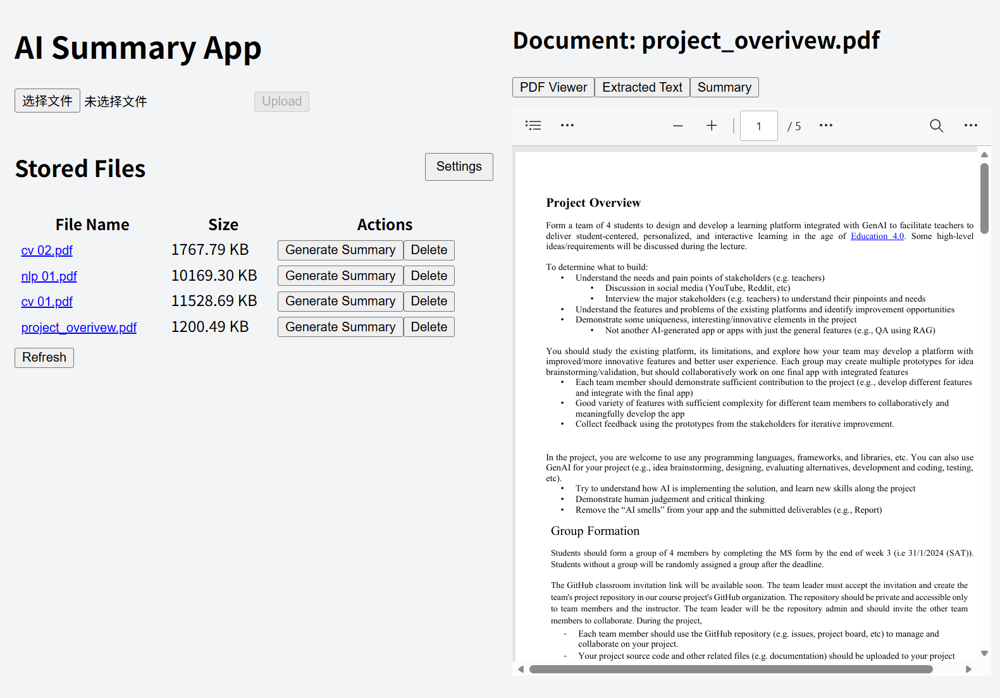
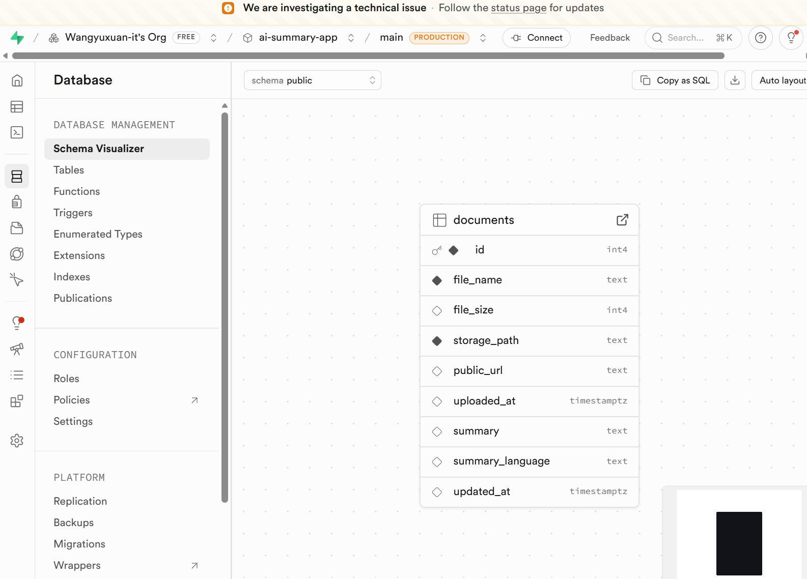
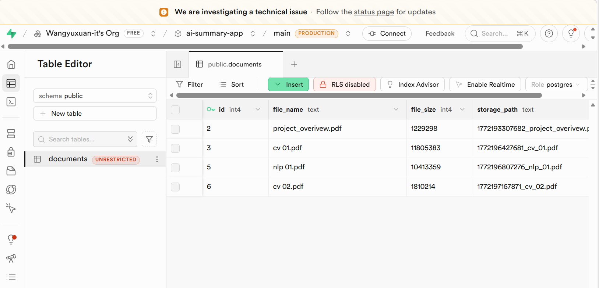
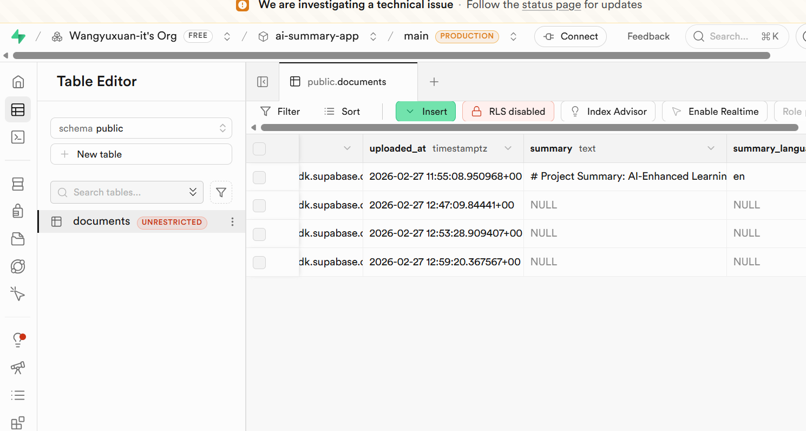
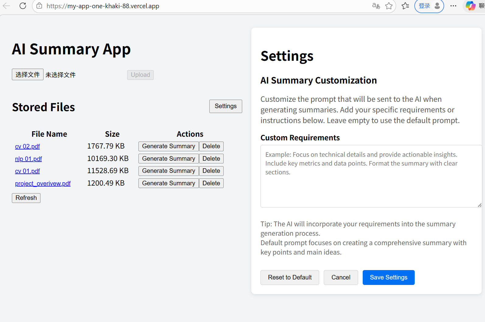

# Task 2: File upload, AI summary, and database integration

## Introduction
In this task, I build on the foundation from Task 1 and implement the core features of the AI Summary App: file upload to Supabase Storage, AI-generated summaries using DeepSeek API, integration with Supabase PostgreSQL database, and a custom settings panel for prompt customization.

---

## Section 6: Supabase Object Store – File Upload and Management

### Step 1: Create a Supabase bucket
1. Log in to your Supabase dashboard and create a new project (or use an existing one).
2. In the **Storage** section, create a new public bucket named `documents`.
   

### Step 2: Install Supabase client
In your `my-app` folder, run:
npm install @supabase/supabase-js

### Step 3: Configure environment variables
Create a .env.local file in the my-app root and add:

```text
NEXT_PUBLIC_SUPABASE_URL=your_supabase_url
NEXT_PUBLIC_SUPABASE_ANON_KEY=your_anon_key
```
Important: Never commit this file; it is already ignored by .gitignore.

### Step 4: Create a Supabase client utility
Create app/lib/supabase.ts with:

```typescript
import { createClient } from '@supabase/supabase-js'

const supabaseUrl = process.env.NEXT_PUBLIC_SUPABASE_URL!
const supabaseAnonKey = process.env.NEXT_PUBLIC_SUPABASE_ANON_KEY!

export const supabase = createClient(supabaseUrl, supabaseAnonKey)
```

### Step 5: Create the upload API route
Create app/api/upload/route.ts with the following code. It includes a function to sanitize file names (prevent errors from special characters).

```typescript
import { NextRequest, NextResponse } from 'next/server';
import { supabase } from '../../lib/supabase';

function sanitizeFileName(fileName: string): string {
  const lastDotIndex = fileName.lastIndexOf('.');
  const baseName = lastDotIndex === -1 ? fileName : fileName.substring(0, lastDotIndex);
  const extension = lastDotIndex === -1 ? '' : fileName.substring(lastDotIndex);
  const safeBase = baseName.replace(/[^a-zA-Z0-9_-]/g, '_');
  const truncatedBase = safeBase.slice(0, 100);
  return truncatedBase + extension;
}

export async function POST(req: NextRequest) {
  try {
    const formData = await req.formData();
    const file = formData.get('file') as File;
    if (!file) {
      return NextResponse.json({ error: 'No file provided' }, { status: 400 });
    }

    const originalName = file.name;
    const safeOriginal = sanitizeFileName(originalName);
    const fileName = `${Date.now()}_${safeOriginal}`;
    const buffer = Buffer.from(await file.arrayBuffer());

    const { error: storageError } = await supabase.storage
      .from('documents')
      .upload(fileName, buffer, {
        contentType: file.type,
        cacheControl: '3600',
        upsert: false,
      });

    if (storageError) throw storageError;

    const { data: urlData } = supabase.storage
      .from('documents')
      .getPublicUrl(fileName);

    return NextResponse.json({
      name: originalName,
      size: file.size,
      url: urlData.publicUrl,
      uploadedAt: new Date().toISOString(),
    });
  } catch (error: any) {
    console.error('Upload error:', error);
    return NextResponse.json({ error: error.message }, { status: 500 });
  }
}
```

### Step 6: Create the file list API route
Create app/api/files/route.ts to list files from the storage bucket (temporary; later we will switch to database).

```typescript
import { NextResponse } from 'next/server';
import { supabase } from '../../lib/supabase';

export async function GET() {
  try {
    const { data, error } = await supabase.storage
      .from('documents')
      .list();

    if (error) throw error;

    const files = await Promise.all(
      data.map(async (item) => {
        const { data: urlData } = supabase.storage
          .from('documents')
          .getPublicUrl(item.name);
        return {
          id: item.id,
          name: item.name,
          size: item.metadata?.size || 0,
          url: urlData.publicUrl,
          uploadedAt: item.created_at,
        };
      })
    );

    return NextResponse.json(files);
  } catch (error) {
    return NextResponse.json({ error: 'Failed to list files' }, { status: 500 });
  }
}
```

### Step 7: Create the delete API route
Create app/api/files/[id]/route.ts (initially using file name as ID, later we will use database ID).

```typescript
import { NextRequest, NextResponse } from 'next/server';
import { supabase } from '../../../lib/supabase';

export async function DELETE(
  req: NextRequest,
  { params }: { params: Promise<{ id: string }> }
) {
  try {
    const { id } = await params;
    const fileName = id;

    const { error } = await supabase.storage
      .from('documents')
      .remove([fileName]);

    if (error) throw error;

    return NextResponse.json({ success: true });
  } catch (error: any) {
    return NextResponse.json({ error: error.message }, { status: 500 });
  }
}
```

### Step 8: Create frontend components
FileUploader.tsx: Handles file selection and upload.

FileList.tsx: Displays the list of files with "Generate Summary" and "Delete" buttons.


### Step 9: Test file upload, list, and delete
Run the development server (npm run dev).

Upload a file using the uploader.

Verify the file appears in the list.

Click "Delete" to remove it.


## Section 7: AI Summary for Documents
### Step 1: Get a DeepSeek API key
Sign up at platform.deepseek.com and create an API key.

Add it to .env.local:

```text
DEEPSEEK_API_KEY=sk-your-key
```

### Step 2: Install OpenAI SDK (compatible with DeepSeek)
```bash
npm install openai
```

### Step 3: Create the summarization API route
Create app/api/summarize/route.ts. This API receives file content (already extracted on the frontend) and returns a Markdown-formatted summary.

```typescript
import { NextRequest, NextResponse } from 'next/server';
import OpenAI from 'openai';

const deepseek = new OpenAI({
  apiKey: process.env.DEEPSEEK_API_KEY,
  baseURL: 'https://api.deepseek.com/v1',
});

export async function POST(req: NextRequest) {
  try {
    const body = await req.json();
    const { fileContent, fileName, language = 'en', customPrompt = '' } = body;

    if (!fileContent) {
      return NextResponse.json({ error: 'Missing file content' }, { status: 400 });
    }

    const maxLength = 15000;
    const truncatedContent = fileContent.length > maxLength
      ? fileContent.substring(0, maxLength) + '... [truncated]'
      : fileContent;

    const languageName = language === 'zh' ? '中文' : 'English';
    let prompt = `Please summarize the following document in ${languageName} using Markdown format (headings, lists, etc.):\n\n${truncatedContent}`;
    if (customPrompt) {
      prompt = `${customPrompt}\n\nDocument content:\n${truncatedContent}`;
    }

    let summary: string;
    try {
      const completion = await deepseek.chat.completions.create({
        model: 'deepseek-chat',
        messages: [{ role: 'user', content: prompt }],
        temperature: 0.3,
        max_tokens: 1000,
      });
      summary = completion.choices[0]?.message?.content || 'No summary generated.';
    } catch (aiError: any) {
      console.error('AI error:', aiError);
      if (aiError.status === 402) {
        summary = '【Insufficient API balance】Please check your DeepSeek account.';
      } else {
        summary = `【AI Service Error】${aiError.message}`;
      }
    }

    return NextResponse.json({ summary });
  } catch (error: any) {
    return NextResponse.json({ error: error.message }, { status: 500 });
  }
}
```

### Step 4: Frontend PDF text extraction with PDF.js
Since backend PDF parsing can be problematic, we extract text on the frontend using PDF.js.

1.Install pdfjs-dist:

```bash
npm install pdfjs-dist
```

2.Copy the worker file to the public folder:

```bash
cp node_modules/pdfjs-dist/build/pdf.worker.min.mjs public/pdf.worker.min.js
```
3.In app/page.tsx, dynamically import PDF.js and set the worker source inside a useEffect:

```tsx
useEffect(() => {
  const loadPdfJs = async () => {
    const pdfjs = await import('pdfjs-dist');
    const workerUrl = window.location.origin + '/pdf.worker.min.js';
    pdfjs.GlobalWorkerOptions.workerSrc = workerUrl;
    setPdfJs(() => pdfjs);
  };
  loadPdfJs();
}, []);
```

4.In generateSummary, if the file is a PDF, use PDF.js to extract text:

```tsx
if (fileExtension === 'pdf') {
  const loadingTask = pdfJs.getDocument(file.url);
  const pdf = await loadingTask.promise;
  const pageTexts = [];
  for (let i = 1; i <= pdf.numPages; i++) {
    const page = await pdf.getPage(i);
    const content = await page.getTextContent();
    const strings = content.items.map((item: any) => item.str);
    pageTexts.push(strings.join(' '));
  }
  textContent = pageTexts.join('\n');
}
```

### Step 5: Update generateSummary to send content to backend
After extracting text, call the summarization API and display the result using ReactMarkdown.

### Step 6: Test database integration

Generate a summary → verify that the summary column is updated.


## Section 8: Database Integration with Supabase
### Step 1: Create the documents table in Supabase
Go to the SQL Editor in Supabase and run:

```sql
CREATE TABLE documents (
  id SERIAL PRIMARY KEY,
  file_name TEXT NOT NULL,
  file_size INTEGER NOT NULL,
  storage_path TEXT NOT NULL,
  public_url TEXT NOT NULL,
  summary TEXT,
  summary_language TEXT,
  uploaded_at TIMESTAMP WITH TIME ZONE DEFAULT NOW()
);
```



### Step 2: Modify upload API to insert a database record
In app/api/upload/route.ts, after successful storage upload, insert a row into the documents table:

```typescript
const { data: dbData, error: dbError } = await supabase
  .from('documents')
  .insert([{
    file_name: originalName,
    file_size: file.size,
    storage_path: fileName,
    public_url: urlData.publicUrl,
  }])
  .select()
  .single();

if (dbError) {
  // Rollback storage upload
  await supabase.storage.from('documents').remove([fileName]);
  throw dbError;
}

return NextResponse.json({
  id: dbData.id,
  name: dbData.file_name,
  size: dbData.file_size,
  url: dbData.public_url,
  uploadedAt: dbData.uploaded_at,
});
```

### Step 3: Modify file list API to read from the database
Replace the content of app/api/files/route.ts with:

```typescript
import { NextResponse } from 'next/server';
import { supabase } from '../../lib/supabase';

export async function GET() {
  try {
    const { data, error } = await supabase
      .from('documents')
      .select('*')
      .order('uploaded_at', { ascending: false });

    if (error) throw error;

    const files = data.map(item => ({
      id: item.id,
      name: item.file_name,
      size: item.file_size,
      url: item.public_url,
      uploadedAt: item.uploaded_at,
    }));

    return NextResponse.json(files);
  } catch (error) {
    return NextResponse.json({ error: 'Failed to fetch files' }, { status: 500 });
  }
}
```

### Step 4: Modify delete API to delete both storage and database record
Update app/api/files/[id]/route.ts:

```typescript
import { NextRequest, NextResponse } from 'next/server';
import { supabase } from '../../../lib/supabase';

export async function DELETE(
  req: NextRequest,
  { params }: { params: Promise<{ id: string }> }
) {
  try {
    const { id } = await params;
    const fileId = id;

    // First, get storage_path from database
    const { data: file, error: fetchError } = await supabase
      .from('documents')
      .select('storage_path')
      .eq('id', fileId)
      .single();

    if (fetchError || !file) {
      return NextResponse.json({ error: 'File not found' }, { status: 404 });
    }

    // Delete from storage
    const { error: storageError } = await supabase.storage
      .from('documents')
      .remove([file.storage_path]);

    if (storageError) throw storageError;

    // Delete database record
    const { error: dbError } = await supabase
      .from('documents')
      .delete()
      .eq('id', fileId);

    if (dbError) throw dbError;

    return NextResponse.json({ success: true });
  } catch (error: any) {
    return NextResponse.json({ error: error.message }, { status: 500 });
  }
}
```

### Step 5: Modify summarization API to update the database
In app/api/summarize/route.ts, after generating the summary, update the corresponding document record (requires fileId from frontend):

```typescript
if (fileId) {
  await supabase
    .from('documents')
    .update({ summary, summary_language: language })
    .eq('id', fileId);
}
```
On the frontend, modify generateSummary to include fileId in the request body.

### Step 6: Test database integration
Upload a file → check that a record appears in the documents table.

Generate a summary → verify that the summary column is updated.

Delete a file → confirm both database record and storage file are removed.





## Section 9: Additional Feature – Custom Settings Panel
I implemented a settings panel that allows users to customize the AI prompt.

### Step 1: Create SettingsPanel component
app/components/SettingsPanel.tsx:

```tsx
'use client';
import { useState, useEffect } from 'react';

export default function SettingsPanel({ onClose }: { onClose: () => void }) {
  const [customPrompt, setCustomPrompt] = useState('');

  useEffect(() => {
    const saved = localStorage.getItem('customSummaryPrompt');
    if (saved) setCustomPrompt(saved);
  }, []);

  const saveSettings = () => {
    localStorage.setItem('customSummaryPrompt', customPrompt);
    onClose();
  };

  const resetToDefault = () => {
    setCustomPrompt('');
    localStorage.removeItem('customSummaryPrompt');
  };

  return (
    <div style={{ padding: 20, background: '#fff', borderRadius: 8 }}>
      <h2>AI Summary Customization</h2>
      <p>Customize the prompt sent to the AI. Leave empty for default.</p>
      <textarea
        rows={6}
        value={customPrompt}
        onChange={(e) => setCustomPrompt(e.target.value)}
        style={{ width: '100%', padding: 8 }}
        placeholder="Example: Focus on technical details and provide actionable insights."
      />
      <div style={{ marginTop: 16 }}>
        <button onClick={resetToDefault}>Reset to Default</button>
        <button onClick={onClose}>Cancel</button>
        <button onClick={saveSettings}>Save Settings</button>
      </div>
    </div>
  );
}
```

### Step 2: Integrate settings panel into the main page
In app/page.tsx:

Add state const [showSettings, setShowSettings] = useState(false);

In the left column, next to "Stored Files", add a Settings button: ```
<button onClick={() => 
setShowSettings(true)}>Settings</button>
```

In the right column, conditionally render SettingsPanel when showSettings is true.

### Step 3: Use the custom prompt in generateSummary
Read from localStorage before calling the API:

```tsx
const customPrompt = localStorage.getItem('customSummaryPrompt') || '';
```
Include it in the request body.

### Step 4: Test the settings panel
Click Settings, enter a custom requirement (e.g., "Summarize in one paragraph"), save.

Generate a summary – it should follow the custom instruction.



## Testing the Application
### Happy Path (Normal Flow)
User opens the app and sees the upload area and empty file list.

User selects a file (text or PDF) and clicks "Upload". The file appears in the list.

User clicks "Generate Summary" for a file. After a few seconds, a nicely formatted Markdown summary appears in the right panel.

User can switch between PDF Viewer, Extracted Text (placeholder), and Summary tabs.

User clicks "Delete" – a confirmation dialog appears; after confirmation, the file disappears from the list and is removed from storage/database.

User clicks "Settings", enters a custom prompt, saves, and generates another summary – the output reflects the custom instruction.

## Exceptional Cases (Edge Cases)
File with special characters in name (e.g., my#file?.txt): The upload sanitizer replaces unsafe characters with underscores, so upload succeeds.

PDF with no extractable text (scanned document): PDF.js extraction returns an empty string; the app shows a fallback message.

DeepSeek API insufficient balance: The API returns a 402 error, and the app displays a user-friendly message.

Network failure during summary generation: The frontend catches the error and alerts the user.

Deleting a file that no longer exists in storage (race condition): The API first checks the database; if the record is missing, it returns 404.

Uploading a file with size exceeding the browser limit: The browser handles it; we assume files are small for this exercise.

All tests have been performed both locally and on the Vercel production deployment, and the app behaves as expected.

## Conclusion
This task successfully implements a full-stack AI-powered document summarizer with file management, database persistence, and a customizable prompt feature. The application is deployed on Vercel and ready for grading.
